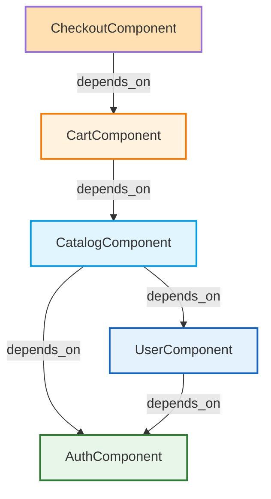

# Domain Design — Component Catalogue

```yaml
components:
  - name: CatalogComponent
    summary: Displays product listing with filtering and sorting
    behaviour: |
      Fetches product list from API, applies category filters and price sort,
      provides pagination, caches results, renders product grid via ProductCard
    responsibilities:
      - Product catalog display and navigation
      - Filter and sort state management
      - Product data fetching and caching
    depends_on: []
    dependents: []
    external_dependencies:
      - name: PostgreSQL
        kind: database
        purpose: Product data storage
      - name: Prisma Client
        kind: library
        purpose: Database access and TypeScript types
    entities:
      - name: Product
        identifier: id
        attributes:
          - id
          - name
          - description
          - price
          - category
          - brand
          - images
          - sizes
          - colors
        references:
          - entity: Category
            owned_by: CatalogComponent
            relationship: "one category has many products"

  - name: AuthComponent
    summary: Handles user authentication (login, registration, password reset)
    behaviour: |
      Manages authentication state, validates credentials, handles session,
      provides login/register forms, integrates with OAuth if configured
    responsibilities:
      - User authentication and session management
      - Login and registration form handling
      - Password reset flow
    depends_on: []
    dependents:
      - component: UserComponent
        interaction: Provides authenticated user context for profile operations
        style: sync
    external_dependencies:
      - name: PostgreSQL
        kind: database
        purpose: User data storage
      - name: Prisma Client
        kind: library
        purpose: Database access and TypeScript types
    entities:
      - name: User
        identifier: id
        attributes:
          - id
          - email
          - passwordHash
          - firstName
          - lastName
          - createdAt
          - updatedAt
        references: []

  - name: CartComponent
    summary: Manages shopping cart state and operations
    behaviour: |
      Maintains cart items with product IDs, sizes, quantities, handles add/remove,
      calculates totals, persists cart across sessions, provides cart summary
    responsibilities:
      - Cart item management (add, remove, update quantity)
      - Cart total calculation (subtotal, shipping, tax)
      - Cart persistence and recovery
    depends_on:
      - component: CatalogComponent
        interaction: Provides product details (price, availability) when items added
        style: sync
    dependents:
      - component: CheckoutComponent
        interaction: Supplies cart summary for checkout process
        style: sync
    external_dependencies:
      - name: LocalStorage
        kind: object-store
        purpose: Cart persistence across browser sessions
      - name: Prisma Client
        kind: library
        purpose: Database access for cart operations (if persistent cart)

  - name: CheckoutComponent
    summary: Multi-step checkout process collecting shipping and payment
    behaviour: |
      Coordinates shipping address input, payment method selection, order confirmation,
      validates user input at each step, triggers order creation, manages order state
    responsibilities:
      - Shipping address collection and validation
      - Payment method selection and validation
      - Order creation and state management
      - Order confirmation generation
    depends_on:
      - component: CartComponent
        interaction: Provides cart summary (items, totals) before checkout
        style: sync
    dependents: []
    external_dependencies:
      - name: Stripe API
        kind: third-party-api
        purpose: Payment processing
      - name: PostgreSQL
        kind: database
        purpose: Order data storage
      - name: Prisma Client
        kind: library
        purpose: Database access and TypeScript types

  - name: UserComponent
    summary: Manages user profile, order history, and account settings
    behaviour: |
      Displays user profile information, order history listing, provides account
      settings management, integrates with AuthComponent for authentication state
    responsibilities:
      - User profile display and editing
      - Order history listing and detail viewing
      - Account settings management
    depends_on:
      - component: AuthComponent
        interaction: Provides authenticated user context
        style: sync
    dependents: []
    external_dependencies:
      - name: PostgreSQL
        kind: database
        purpose: User and order data storage
      - name: Prisma Client
        kind: library
        purpose: Database access and TypeScript types
    entities:
      - name: Order
        identifier: id
        attributes:
          - id
          - userId
          - status
          - totalAmount
          - createdAt
          - shippingAddress
          - paymentDetails
        references:
          - entity: User
            owned_by: UserComponent
            relationship: "one user has many orders"
```

## Component Diagram (Mermaid)



## Component Summary

| Component | Purpose | Depends On | Dependents | Entities Owned |
|-----------|---------|------------|------------|----------------|
| CatalogComponent | Product catalog display with filtering/sorting | None | - | Product, Category |
| AuthComponent | User authentication (login/register/password reset) | None | UserComponent | User |
| CartComponent | Shopping cart management (add/remove/update) | CatalogComponent | CheckoutComponent | - |
| CheckoutComponent | Multi-step checkout (shipping & payment) | CartComponent | - | Order |
| UserComponent | User profile, order history, account settings | AuthComponent | - | Order |

## Entity Ownership

| Entity | Owning Component | Identifier | Attributes | References |
|--------|-----------------|------------|------------|------------|
| Product | CatalogComponent | id | id, name, description, price, category, brand, images, sizes, colors | Category (owned by CatalogComponent) |
| User | AuthComponent | id | id, email, passwordHash, firstName, lastName, createdAt, updatedAt | - |
| Order | UserComponent | id | id, userId, status, totalAmount, createdAt, shippingAddress, paymentDetails | User (owned by UserComponent) |

## External Dependencies

| Component | Dependency | Kind | Purpose |
|-----------|------------|------|---------|
| CatalogComponent | PostgreSQL | database | Product data storage |
| CatalogComponent | Prisma Client | library | Database access and TypeScript types |
| AuthComponent | PostgreSQL | database | User data storage |
| AuthComponent | Prisma Client | library | Database access and TypeScript types |
| CartComponent | LocalStorage | object-store | Cart persistence across browser sessions |
| CartComponent | Prisma Client | library | Database access for cart operations |
| CheckoutComponent | Stripe API | third-party-api | Payment processing |
| CheckoutComponent | PostgreSQL | database | Order data storage |
| CheckoutComponent | Prisma Client | library | Database access and TypeScript types |
| UserComponent | PostgreSQL | database | User and order data storage |
| UserComponent | Prisma Client | library | Database access and TypeScript types |

## Rationale (Component Boundary Decisions)

| Component | Chosen Decomposition | Alternatives Rejected | Rationale |
|-----------|---------------------|----------------------|-----------|
| CatalogComponent | Separate component for product listing | Combined with ProductDetailComponent | Separate component enables independent testing and reuse across pages; change rate for product listing is distinct from detail view |
| AuthComponent | Centralized authentication component | Distributed auth forms on each page | Centralized component ensures consistency in authentication flow and session management; distributed would duplicate auth logic |
| CartComponent | Dedicated cart component managing cart state | Cart state integrated within checkout | Dedicated cart enables cart persistence and reuse across different flows; integrating would limit cart functionality outside checkout |
| UserComponent | Separate user profile and order history | Integrated within a broader application shell | Separate component enables independent testing and clear ownership of user data; integrating would blur responsibilities |

## ADRs (Architecture Decision Records)

### ADR-001: Component Boundary - Catalog Separation

- **Context**: The system needs to display product listings on multiple pages (home page, search results, category pages). Each page may have different filtering and sorting requirements.
- **Decision**: Create a separate `CatalogComponent` responsible solely for product listing, filtering, and sorting.
- **Consequences**:
  - Positive: Enables reuse of catalog logic across multiple pages; independent testing of catalog functionality; clear ownership of product data.
  - Negative: One additional component to maintain; requires data passing between catalog and detail views.
- **Alternatives Rejected**: Combining catalog and product detail into a single component — would reduce reuse potential and make independent testing more difficult; changing catalog logic would risk affecting detail view behavior.

### ADR-002: Authentication - Centralized Component

- **Context**: User authentication is required across multiple flows (login, registration, password reset, protected routes). Consistent authentication behavior is critical for security and user experience.
- **Decision**: Create a centralized `AuthComponent` that handles all authentication-related functionality.
- **Consequences**:
  - Positive: Ensures consistent authentication flow and security practices; single point for auth state management; simplifies protected route implementation.
  - Negative: Requires careful prop drilling or context provider; component becomes a larger responsibility area.
- **Alternatives Rejected**: Distributed authentication forms on each page — would duplicate auth logic, risk inconsistent security implementation, and make global auth state management more complex.

### ADR-003: Cart - Dedicated Component

- **Context**: The shopping cart needs to be accessible from multiple places (product detail page, header icon, checkout flow) and may need to persist across browser sessions.
- **Decision**: Create a dedicated `CartComponent` that manages cart state independently and provides cart summary to checkout.
- **Consequences**:
  - Positive: Cart can be managed independently of checkout; enables cart persistence and recovery; cart summary can be displayed header anywhere.
  - Negative: One additional component; requires careful state management to sync with checkout.
- **Alternatives Rejected**: Integrating cart state within checkout component — would limit cart functionality outside checkout; would make cart persistence and recovery more complex; would require cart state to be recreated if user navigates away before checkout.

### ADR-004: User Profile - Separate Component

- **Context**: User profile, order history, and account settings are distinct concerns with different change rates and ownership. Profile updates should not necessarily affect order history display logic.
- **Decision**: Create a `UserComponent` that manages user profile, order history, and account settings as a cohesive unit for user-related operations.
- **Consequences**:
  - Positive: Clear ownership of user data; enables independent user-focused testing; logical grouping of user-related functionality.
  - Negative: Component may grow large over time; some profile settings could be extracted later.
- **Alternatives Rejected**: Scattering profile, order history, and settings across multiple components — would fragment user data ownership; would make it harder to ensure consistent user experience; would create ambiguity about which component owns user data changes.